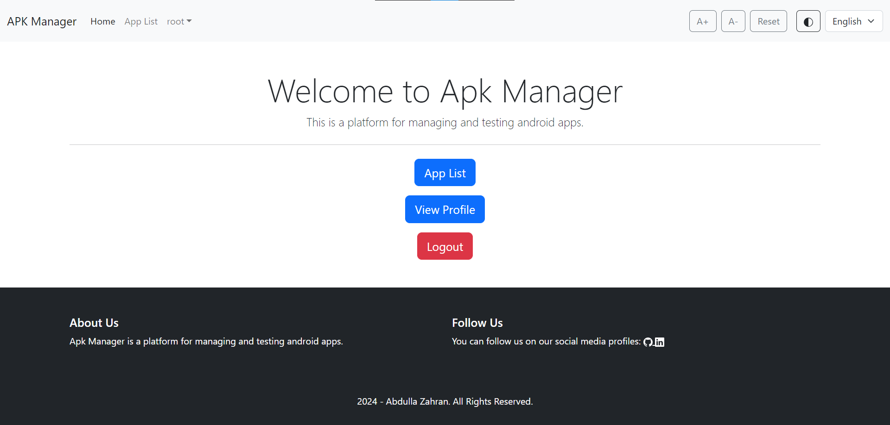

# APK Manager
APK Manager is a Django-based web application designed to manage and evaluate Android APK files. The application provides features such as user authentication, APK metadata extraction, app evaluation using Appium, accessibility options, multilingual support, and more.



# Features
- User Authentication & Management: Secure login and registration system.
- APK Metadata Extraction: Extract essential metadata from APK files using pyaxmlparser.
- App Evaluation with Appium: Evaluate and test APKs using Appium integration.
- Accessibility Features: Support for high contrast mode and adjustable font sizes.
- Multilingual Support: Switch between English and French dynamically.
- Docker Support: Easily deploy the project using Docker and Docker Compose.

# Table of Contents
- [Installation](README.md#installation)
- [Usage](README.md#usage)
- [Running Tests](README.md#running-tests)
- [Docker Setup](README.md#docker-setup)
- [Project Structure](README.md#project-structure)
- [Screenshots](README.md#screenshots)
- [Contributing](README.md#contributing)
- [License](README.md#license)

# Installation
## Prerequisites
- Python 3.8+
- Django 4.0+
- Docker & Docker Compose (optional but recommended)

## Step 1: Clone the Repository
```bash
git clone https://github.com/Abdolla25/APK-Manager.git
cd APK-Manager
```

## Step 2: Install Dependencies
Create and activate a virtual environment:
```bash
python -m venv env
source env/bin/activate  # On Windows use `env\Scripts\activate`
```

Install the required Python packages:
```bash
pip install -r requirements.txt
```

## Step 3: Set Up the Database
Apply the migrations to set up the database:
```bash
python manage.py migrate
```

## Step 4: Run the Development Server
Start the development server:
```bash
python manage.py runserver
```
The application will be accessible at `http://127.0.0.1:8000/`.

# Usage
1. Upload APKs: Navigate to the APK upload page and upload your APK files to extract metadata.
2. App Evaluation: Use the Appium integration to run evaluations on uploaded APKs.
3. Accessibility Settings: Adjust font size and enable high contrast mode from the accessibility settings.
4. Language Switching: Use the language switcher in the navbar to switch between English and French.

# Running Tests
To run the basic tests included in the project, use:
```bash
python manage.py test web
```
This will run unit tests for user authentication, model creation, views, and the language switcher.

# Docker Setup
## Dockerfile
The project includes a Dockerfile for easy deployment:

```Dockerfile
FROM python:3.9

# Environment Variables
ENV PYTHONDONTWRITEBYTECODE=1
ENV PYTHONUNBUFFERED=1

WORKDIR /code

RUN pip install --upgrade pip
COPY requirements.txt /code/
RUN pip install --no-cache-dir -r requirements.txt

COPY ./apk_manager /code/

EXPOSE 8000

CMD ["gunicorn", "--bind", ":8000", "apk_manager.wsgi:application", "--reload"]
```

## Docker Compose
To run the project with PostgreSQL using Docker Compose:

1. Use the `docker-compose.yml` file included:
```yaml
services:
  db:
    image: mysql:8.0
    environment:
      MYSQL_DATABASE: ${MYSQL_DATABASE}
      MYSQL_USER: ${MYSQL_USER}
      MYSQL_PASSWORD: ${MYSQL_PASSWORD}
      MYSQL_ROOT_PASSWORD: ${MYSQL_ROOT_PASSWORD}
    volumes:
      - db_data:/var/lib/mysql

  appium:
    image: appium/appium
    ports:
      - "4723:4723"
    volumes:
      - ./apk_manager/media:/code/media
    environment:
      - REMOTE_ADB=true
      - ANDROID_DEVICES=${ANDROID_DEVICE_ID}

  web:
    build: .
    command: gunicorn --bind :8000 apk_manager.wsgi:application --reload
    volumes:
      - ./apk_manager:/code
    ports:
      - "8000:8000"
    depends_on:
      - db
      - appium
    environment:
      - MYSQL_HOST=${MYSQL_HOST}
      - MYSQL_DATABASE=${MYSQL_DATABASE}
      - MYSQL_USER=${MYSQL_USER}
      - MYSQL_PASSWORD=${MYSQL_PASSWORD}
      - MYSQL_PORT=${MYSQL_PORT}
      - SECRET_KEY=${SECRET_KEY}
      - DEBUG=${DEBUG}
      - APPIUM_HOST=${APPIUM_HOST}
      - APPIUM_PORT=${APPIUM_PORT}
      - ANDROID_DEVICE_ID=${ANDROID_DEVICE_ID}

volumes:
  db_data:
```

2. Run the application:
```bash
docker compose up --build
```

# Project Structure
```plaintext
apk_manager/
│
├── apk_manager/         # Project configuration directory
│   ├── settings.py      # Project settings
│   ├── urls.py          # URL configurations
│   ├── wsgi.py          # WSGI application
│   └── asgi.py          # ASGI application
│
├── web/                 # Django app for all web-related logic
│   ├── migrations/      # Database migrations
│   ├── templates/       # HTML templates
│   ├── static/          # Static files (CSS, JS)
│   ├── models.py        # Models
│   ├── views.py         # Views
│   ├── tests.py         # Basic tests
│   └── urls.py          # URL routing for the app
│
├── locale/              # Translation files
├── Dockerfile           # Dockerfile for the project
├── docker-compose.yml   # Docker Compose file
├── manage.py            # Django management script
├── requirements.txt     # Python dependencies
└── README.md            # Project documentation
```

# Screenshots

Screenshots of the application can be found in the [screenshots.md](screenshots.md) file.


# Contributing
Contributions are welcome! Please submit a pull request or open an issue to discuss your ideas or report bugs.

# License
This project is licensed under the MIT License. See the [LICENSE](LICENSE) for details.
